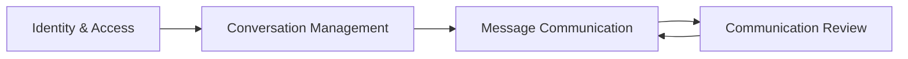

# Bounded contexts

O MVP é organizado em **quatro bounded contexts** simples, com dependências explícitas e responsabilidades bem delimitadas.



## Identity & Access

**Responsabilidade:** autenticação, autorização, `User`, `Account`, `Role`, `Permission`.

**Não faz:** revisar mensagens, gerenciar conversas.

## Conversation Management

**Responsabilidade:** ciclo de vida de `Conversation` (abrir, atribuir, encerrar).

**Não faz:** enviar mensagens, chamar LLM.

## Message Communication

**Responsabilidade:** criar, editar, aprovar e enviar `Message`; publicar `MessageCreated`; orquestrar `MessageDeliveryService`.

**Não faz:** implementar lógica de revisão semântica (delega ao contexto Review).

## Communication Review

**Responsabilidade:** avaliar mensagens via `CommunicationPolicy` e `AIReviewService`; produzir `MessageReview` e `ReviewResult`.

## Regras invioláveis

| Regra | Motivo |
|-------|--------|
| **Review não envia mensagem** | Evita acoplamento entre avaliação e entrega |
| **Review não controla usuário** | Autenticação/autorização pertence a Identity |
| **Review não controla conversa** | Conversa pertence a Conversation Management |
| **Review apenas produz `MessageReview`** | Responsabilidade única e testável |

Sem essas regras, o sistema tende a evoluir para um emaranhado:

```text
AIService → ConversationService → MessageService → UserService → AIService
```
