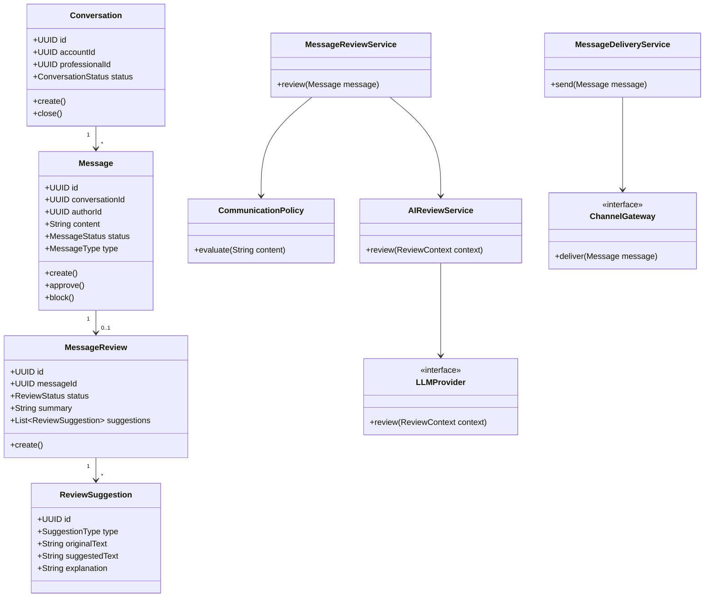

# Diagrama de classes (MVP)

## Identity & Access (MVP-01)

| Classe | Responsabilidade |
|--------|------------------|
| `AuthenticationService` | Login e emissão de JWT |
| `AuthorizationService` | Verificação de `PermissionCode` |
| `AccountScopedAccess` | Isolamento por `accountId` |
| `IdentityProvider` / `DbIdentityProvider` | Autenticação contra PostgreSQL |
| `JwtService` | Geração e parsing de token |

## Serviços de aplicação principais

| Classe | Responsabilidade |
|--------|------------------|
| `MessageApplicationService` | Orquestra criação, edição, aprovação de mensagens |
| `MessageReviewService` | Orquestra políticas + IA, produz `ReviewResult` |
| `AIReviewService` | Adapta contexto para `LLMProvider` |
| `MessageDeliveryService` | Envia mensagem aprovada via `ChannelGateway` |
| `ConversationApplicationService` | CRUD e ciclo de vida de conversas |
