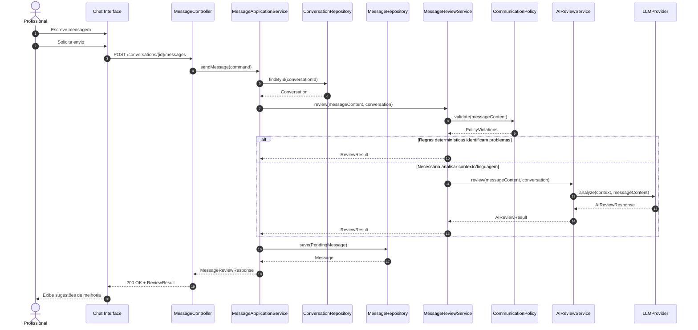

# Fluxo 1 — Envio de mensagem para revisão

Fluxo **mais importante do MVP**.

## Termos introduzidos

- `Professional`, `Conversation`, `Message`, `MessageReview`
- `CommunicationPolicy`, `PolicyViolation`, `ReviewResult`
- `AIReviewService`, `LLMProvider`

> Use **Review**, não `AIValidator`. A IA é capacidade da revisão, não o conceito principal do negócio.
