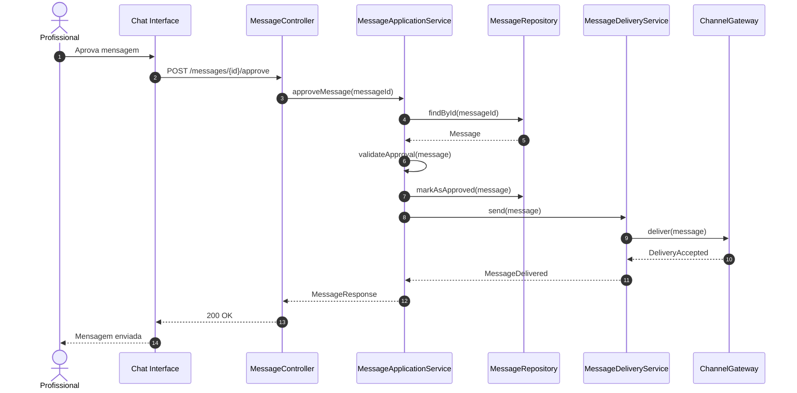

# Fluxo 2 — Aprovação da mensagem

Após a revisão, o profissional aceita a mensagem como está.

```mermaid
sequenceDiagram
    autonumber

    actor Professional as Profissional
    participant ChatUI as Chat Interface
    participant MessageController
    participant MessageApplicationService
    participant MessageRepository
    participant MessageDeliveryService
    participant ChannelGateway

    Professional->>ChatUI: Aprova mensagem

    ChatUI->>MessageController: POST /messages/{id}/approve

    MessageController->>MessageApplicationService: approveMessage(messageId)

    MessageApplicationService->>MessageRepository: findById(messageId)
    MessageRepository-->>MessageApplicationService: Message

    MessageApplicationService->>MessageApplicationService: validateApproval(message)

    MessageApplicationService->>MessageRepository: markAsApproved(message)

    MessageApplicationService->>MessageDeliveryService: send(message)

    MessageDeliveryService->>ChannelGateway: deliver(message)

    ChannelGateway-->>MessageDeliveryService: DeliveryAccepted

    MessageDeliveryService-->>MessageApplicationService: MessageDelivered

    MessageApplicationService-->>MessageController: MessageResponse

    MessageController-->>ChatUI: 200 OK

    ChatUI-->>Professional: Mensagem enviada
```
