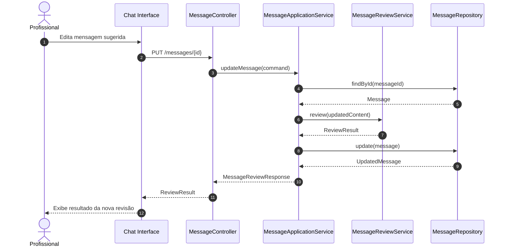

# Fluxo 3 — Edição após sugestão da IA

A proposta **não** é: *"A IA decide o que o profissional pode enviar."*

A proposta **é**: *"A IA revisa e sugere; o profissional decide."*

```mermaid
sequenceDiagram
    autonumber

    actor Professional as Profissional
    participant ChatUI as Chat Interface
    participant MessageController
    participant MessageApplicationService
    participant MessageReviewService
    participant MessageRepository

    Professional->>ChatUI: Edita mensagem sugerida

    ChatUI->>MessageController: PUT /messages/{id}

    MessageController->>MessageApplicationService: updateMessage(command)

    MessageApplicationService->>MessageRepository: findById(messageId)
    MessageRepository-->>MessageApplicationService: Message

    MessageApplicationService->>MessageReviewService: review(updatedContent)

    MessageReviewService-->>MessageApplicationService: ReviewResult

    MessageApplicationService->>MessageRepository: update(message)

    MessageRepository-->>MessageApplicationService: UpdatedMessage

    MessageApplicationService-->>MessageController: MessageReviewResponse

    MessageController-->>ChatUI: ReviewResult

    ChatUI-->>Professional: Exibe resultado da nova revisão
```
