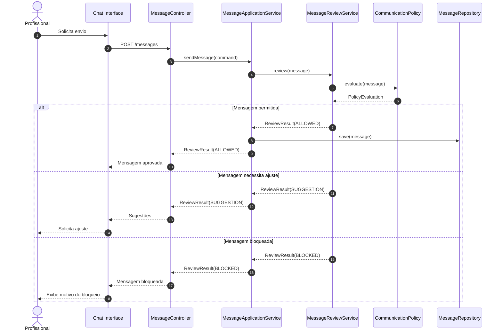

# Fluxo 4 — Bloqueio e sugestão

Separe **sugestão** de **bloqueio** — são conceitos diferentes.

```text
Suggestion → "Seria melhor escrever..."
Block      → "Essa mensagem não pode ser enviada."
```


