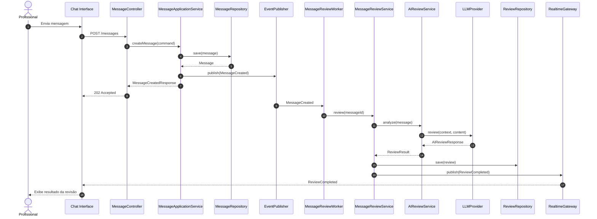

# Fluxo 5 — IA assíncrona (recomendado)

Para escalar, **não deixe a requisição HTTP esperar o LLM**.

## Decisão importante

Use **`MessageCreated`** como domain event — não `SendMessageToAI`.

O evento pertence ao domínio de mensagens. A IA é consequência desse evento, o que torna o sistema mais extensível.
