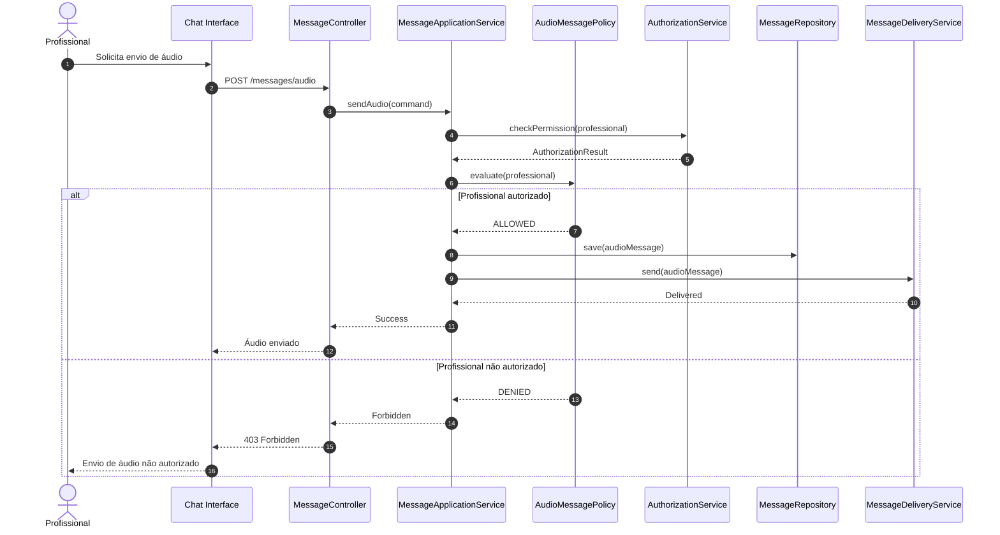

# Fluxo 6 — Mensagem de áudio

Regra do MVP: **somente usuários autorizados podem enviar áudio**.

Modelar como **política de autorização no backend**, não como `if` no frontend.

## Distinção importante

| Componente | Pergunta |
|------------|----------|
| `AuthorizationService` | Esse profissional possui a permissão? |
| `AudioMessagePolicy` | Esse tipo de mensagem pode ser enviado por ele? |

Não misture os dois conceitos.
