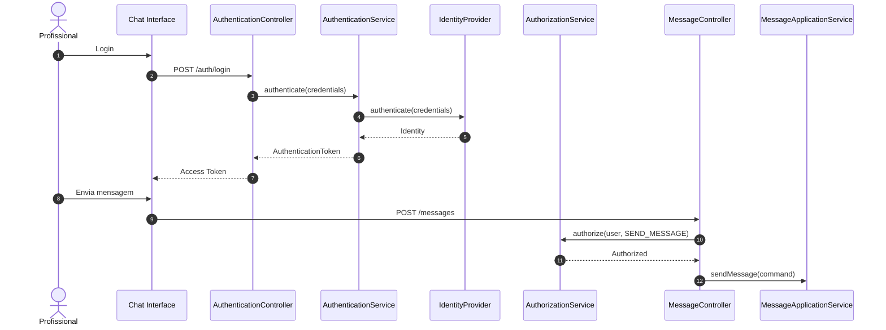

# Fluxo 7 — Autenticação e autorização

Fronteira do MVP:

```text
User → Account → Role → Permission
```


```mermaid
sequenceDiagram
    autonumber

    actor Professional as Profissional
    participant ChatUI as Chat Interface
    participant AuthenticationController
    participant AuthenticationService
    participant IdentityProvider
    participant AuthorizationService
    participant MessageController
    participant MessageApplicationService

    Professional->>ChatUI: Login

    ChatUI->>AuthenticationController: POST /auth/login

    AuthenticationController->>AuthenticationService: authenticate(credentials)

    AuthenticationService->>IdentityProvider: authenticate(credentials)

    IdentityProvider-->>AuthenticationService: Identity

    AuthenticationService-->>AuthenticationController: AuthenticationToken

    AuthenticationController-->>ChatUI: Access Token

    Professional->>ChatUI: Envia mensagem

    ChatUI->>MessageController: POST /messages

    MessageController->>AuthorizationService: authorize(user, SEND_MESSAGE)

    AuthorizationService-->>MessageController: Authorized

    MessageController->>MessageApplicationService: sendMessage(command)
```
