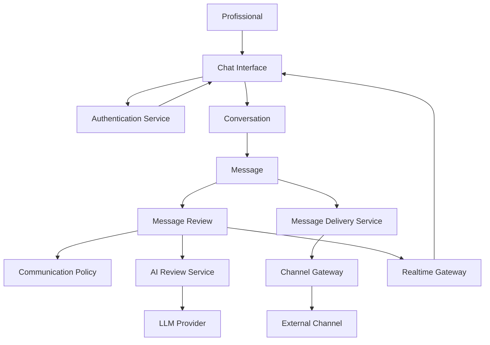
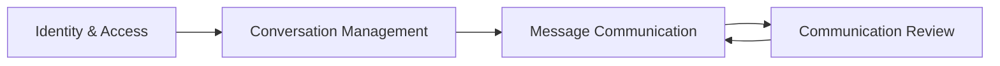

# Fluxo 8 — Visão geral do MVP

```mermaid
flowchart TD

    Professional[Profissional]

    ChatUI[Chat Interface]

    Authentication[Authentication Service]

    Conversation[Conversation]

    Message[Message]

    Review[Message Review]

    Policy[Communication Policy]

    AI[AI Review Service]

    LLM[LLM Provider]

    Delivery[Message Delivery Service]

    Channel[Channel Gateway]

    Realtime[Realtime Gateway]

    Professional --> ChatUI

    ChatUI --> Authentication
    Authentication --> ChatUI

    ChatUI --> Conversation
    Conversation --> Message

    Message --> Review

    Review --> Policy
    Review --> AI

    AI --> LLM

    Review --> Realtime
    Realtime --> ChatUI

    Message --> Delivery
    Delivery --> Channel

    Channel --> ExternalChannel[External Channel]
```

## Bounded contexts no fluxo

```mermaid
flowchart LR

    Identity[Identity & Access]

    Conversation[Conversation Management]

    Communication[Message Communication]

    Review[Communication Review]

    Identity --> Conversation
    Conversation --> Communication
    Communication --> Review

    Review --> Communication
```
