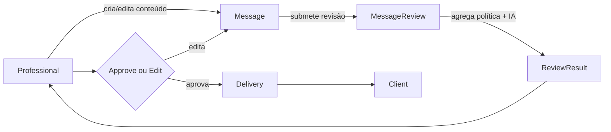
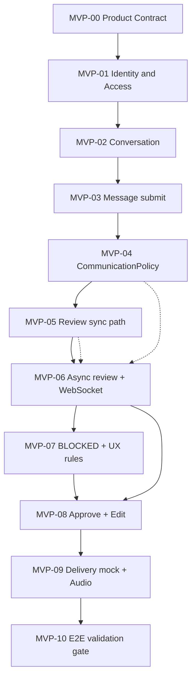

# MVP Product Contract

Contrato consolidado de produto para o MVP do Work Chat IA.  
Fontes especializadas permanecem em `docs/01-produto` … `docs/05-regras-negocio`; este documento é a **fonte única de rastreabilidade** requisito → aceite → card proposto.

Evidência de auditoria: [mvp-00-auditoria.md](mvp-00-auditoria.md).

---

## 1. Objetivo

Validar o núcleo do produto: um profissional redige uma mensagem em contexto de atendimento; o sistema aplica **regras determinísticas** e **revisão semântica assistida por IA**; o profissional **decide** (aprovar, editar ou não enviar); mensagens aprovadas seguem para **entrega** (canal externo via adapter mock no MVP).

Problema endereçado: reduzir mensagens inadequadas e ambíguas sem remover a autonomia do profissional ([proposta-de-valor.md](../01-produto/proposta-de-valor.md)).

Fluxo de valor:

```text
Professional → Message → MessageReview → ReviewResult → Approve/Edit → Delivery → Client
```

---

## 2. Usuários / Atores

| Ator | Quem é | O que pode fazer no MVP | Responsabilidade |
|------|--------|-------------------------|------------------|
| **Professional** | Usuário autenticado que atende clientes | Login; listar/criar conversas; criar/editar mensagens; submeter para revisão; interpretar `ReviewResult`/`ReviewSuggestion`; aprovar ou ajustar; solicitar envio de áudio se autorizado | **Decisão final** sobre o conteúdo enviado |
| **Client** | Destinatário no canal externo | Nenhuma interação com o sistema de revisão | Receber mensagens já aprovadas |
| **Sistema (Message Communication + Review + Delivery)** | Plataforma Work Chat IA | Persistir mensagens e revisões; executar políticas e IA; notificar UI; entregar após aprovação | Orquestrar revisão e entrega **sem** decidir no lugar do profissional |
| **Account / User / Role / Permission** | Modelo de identidade (MVP básico) | Controlar quem acessa e quais ações são permitidas (ex.: `SEND_MESSAGE`, `SEND_AUDIO_MESSAGE`) | Fronteira de organização e autorização |

**Fora do ator no MVP:** Account Administrator com UI de configuração de políticas ([personas.md](../01-produto/personas.md)).

---

## 3. Fluxo principal



### Etapas (comportamento de negócio)

| Etapa | Comportamento esperado |
|-------|------------------------|
| **Professional** | Autentica-se; seleciona ou cria `Conversation`; redige `Message`. |
| **Message** | Unidade de comunicação com ciclo de vida próprio (`MessageStatus`). Ao submeter, entra em fluxo de revisão (ex.: `PENDING_REVIEW`). |
| **MessageReview** | Avaliação da mensagem; ciclo próprio (`ReviewStatus`). Produz `MessageReview` persistível com resumo e `ReviewSuggestion` quando aplicável. **Não envia** mensagem. |
| **ReviewResult** | Agregado apresentado ao profissional: `ALLOWED`, `SUGGESTION` ou `BLOCKED` ([principios-review.md](../05-regras-negocio/principios-review.md)). |
| **Approve / Edit** | Profissional aprova explicitamente ou edita e re-submete. Sistema **não** envia automaticamente após revisão negativa ou com sugestões sem ação explícita. |
| **Delivery** | Após aprovação, `MessageDeliveryService` envia via `ChannelGateway` (**mock** no MVP). Cliente recebe mensagem aprovada. |

**Modo assíncrono (alvo MVP para LLM):** após criar/persistir mensagem, publicar `MessageCreated`; worker executa revisão; UI recebe `ReviewCompleted` via realtime ([05-ia-assincrona.md](../04-fluxos/05-ia-assincrona.md), ADR-002). Detalhes de API → Implementação.

---

## 4. Casos de uso

| ID | Nome | Ator | Objetivo |
|----|------|------|----------|
| UC-001 | Autenticar no sistema | Professional | Obter sessão/token para usar o chat |
| UC-002 | Listar e criar conversas | Professional | Ter contexto de atendimento |
| UC-003 | Enviar mensagem para revisão | Professional | Submeter texto para avaliação |
| UC-004 | Visualizar resultado da revisão | Professional | Ver `ReviewResult` e sugestões |
| UC-005 | Aprovar e entregar mensagem | Professional | Enviar conteúdo aceito ao cliente |
| UC-006 | Editar após sugestão | Professional | Ajustar texto e obter nova revisão |
| UC-007 | Tratar mensagem bloqueada | Professional | Entender impedimento e não enviar |
| UC-008 | Enviar mensagem de áudio autorizada | Professional | Enviar áudio quando permitido |
| UC-009 | Tratar falha de revisão | Professional / Sistema | Saber que revisão falhou e que retry é possível |
| UC-010 | Tratar falha de entrega | Professional / Sistema | Saber que envio ao canal falhou |

### UC-001 — Autenticar no sistema

- **Pré-condições:** `User` existente vinculado a `Account`.
- **Fluxo principal:** credenciais válidas → token/sessão → acesso à interface.
- **Exceções:** credenciais inválidas → falha de autenticação (sem acesso).
- **Resultado:** profissional autenticado.

### UC-002 — Listar e criar conversas

- **Pré-condições:** autenticado; autorizado no `Account`.
- **Fluxo principal:** listar conversas; criar nova `Conversation` associada ao profissional/conta.
- **Exceções:** não autorizado → operação negada.
- **Resultado:** `Conversation` disponível para mensagens.

### UC-003 — Enviar mensagem para revisão

- **Pré-condições:** conversa existente; permissão de envio; conteúdo submetido.
- **Fluxo principal:** sistema cria/atualiza `Message`; dispara revisão (sync ou async conforme fase); profissional eventualmente recebe resultado.
- **Exceções:** conversa inexistente; não autorizado; conteúdo vazio (policy → `BLOCKED`); falha técnica na revisão.
- **Resultado:** `Message` em estado coerente com revisão iniciada ou concluída.

### UC-004 — Visualizar resultado da revisão

- **Pré-condições:** `MessageReview` concluída ou resultado disponível.
- **Fluxo principal:** UI exibe `ReviewResult`, `summary`, `ReviewSuggestion`.
- **Exceções:** revisão `FAILED` → indicar falha e possibilidade de retry (estado documentado).
- **Resultado:** profissional informado para decidir.

### UC-005 — Aprovar e entregar mensagem

- **Pré-condições:** `ReviewResult` permite envio (`ALLOWED` ou após edição que não resulte em `BLOCKED`); mensagem aprovável.
- **Fluxo principal:** ação explícita de aprovação → transição para envio → delivery mock → estados `SENT`/`DELIVERED` conforme domínio.
- **Exceções:** tentativa com `BLOCKED` → impedir; falha no gateway → `FAILED`.
- **Resultado:** cliente recebe mensagem (via mock no MVP).

### UC-006 — Editar após sugestão

- **Pré-condições:** `ReviewResult` = `SUGGESTION`.
- **Fluxo principal:** editar conteúdo → nova revisão → novo resultado exibido.
- **Exceções:** edição resulta em `BLOCKED`.
- **Resultado:** profissional pode aprovar ou continuar ajustando.

### UC-007 — Tratar mensagem bloqueada

- **Pré-condições:** `ReviewResult` = `BLOCKED`.
- **Fluxo principal:** UI exibe motivo; envio desabilitado.
- **Exceções:** n/a.
- **Resultado:** mensagem não entregue até conteúdo corrigido e reavaliado.

### UC-008 — Enviar mensagem de áudio autorizada

- **Pré-condições:** permissão `SEND_AUDIO_MESSAGE`; políticas satisfeitas ([politica-audio.md](../05-regras-negocio/politica-audio.md)).
- **Fluxo principal:** validação backend → persistência → delivery (conforme fluxo 6).
- **Exceções:** `403` sem permissão.
- **Resultado:** áudio enviado ou negado de forma auditável.
- **Pendência:** ver **PRODUCT_DECISION_REQUIRED** — revisão semântica de áudio no MVP ([auditoria C-05](mvp-00-auditoria.md)).

### UC-009 — Tratar falha de revisão

- **Pré-condições:** `MessageReview.status` = `FAILED`.
- **Fluxo principal:** sistema expõe falha; retry possível ([estados.md](../02-dominio/estados.md)).
- **Resultado:** profissional não vê resultado falso como `COMPLETED`.

### UC-010 — Tratar falha de entrega

- **Pré-condições:** mensagem aprovada; falha no `ChannelGateway`.
- **Fluxo principal:** `Message` em `FAILED`; profissional informado.
- **Resultado:** não há confirmação de entrega indevida.

---

## 5. Requisitos funcionais

| ID | Descrição | Origem | Ator | Comportamento esperado | Prioridade | Card proposto |
|----|-----------|--------|------|------------------------|------------|---------------|
| REQ-F-001 | Login e autorização básica (`User`, `Account`, `Role`, `Permission`) | `06-roadmap/mvp.md` | Professional | Autenticar e autorizar ações (`SEND_MESSAGE`, etc.) | Must | MVP-01 |
| REQ-F-002 | Criar e listar `Conversation` | `06-roadmap/mvp.md` | Professional | CRUD mínimo de conversas de atendimento | Must | MVP-02 |
| REQ-F-003 | Criar `Message` e submeter para revisão | `06-roadmap/mvp.md`, fluxo 1 | Professional | Mensagem associada à conversa entra no fluxo de revisão | Must | MVP-03 |
| REQ-F-004 | `CommunicationPolicy` (regras determinísticas) | `06-roadmap/mvp.md`, `communication-policy.md` | Sistema | Avaliar conteúdo; violações → `SUGGESTION` ou `BLOCKED` | Must | MVP-04 |
| REQ-F-005 | `AIReviewService` + `LLMProvider` | `06-roadmap/mvp.md` | Sistema | Revisão semântica quando política/contexto exigir | Must | MVP-05 |
| REQ-F-006 | Exibir `ReviewResult` e `ReviewSuggestion` na UI | `06-roadmap/mvp.md` | Professional | Resultado compreensível e acionável | Must | MVP-06 |
| REQ-F-007 | Aprovar mensagem | `06-roadmap/mvp.md`, fluxo 2 | Professional | Aprovação explícita antes do envio | Must | MVP-08 |
| REQ-F-008 | Editar e reenviar mensagem após sugestão | `06-roadmap/mvp.md`, fluxo 3 | Professional | Nova revisão após edição | Must | MVP-08 |
| REQ-F-009 | Bloquear envio quando `BLOCKED` | `06-roadmap/mvp.md`, fluxo 4 | Sistema / Professional | Impedir aprovação/envio; exibir motivo | Must | MVP-07 |
| REQ-F-010 | Revisão assíncrona (`MessageCreated` + worker + WebSocket) | `06-roadmap/mvp.md`, ADR-002, fluxo 5 | Sistema | HTTP não bloqueia LLM; UI notificada ao concluir | Must | MVP-06 |
| REQ-F-011 | Política de áudio para usuários autorizados | `06-roadmap/mvp.md`, `politica-audio.md` | Professional | Backend valida permissão; nega com 403 | Should | MVP-09 |
| REQ-F-012 | Entrega pós-aprovação com `ChannelGateway` mock | `06-roadmap/mvp.md` (mock), resolução C-03 | Sistema | Mensagem aprovada entregue via adapter substituível | Must | MVP-09 |

> **BACKLOG GAP:** IDs de cards MVP-01 … MVP-10 não existem no repositório; coluna “Card proposto” deriva da [ordem sugerida](mvp.md) e decomposição lógica — validar em gestão de projeto (Issue #2).

---

## 6. Requisitos não funcionais

Somente itens sustentados na documentação ou skills (sem SLA numérico).

| ID | Descrição | Origem |
|----|-----------|--------|
| REQ-NF-001 | PostgreSQL como fonte de verdade | `03-arquitetura/visao-geral.md`, skills README/DBA |
| REQ-NF-002 | Redis como infraestrutura auxiliar (filas/workers), não substitui banco | `03-arquitetura/stack-mvp.md`, skills |
| REQ-NF-003 | Revisão por LLM não deve bloquear requisição HTTP principal (modo assíncrono) | ADR-002 |
| REQ-NF-004 | Estados de `Message` e `MessageReview` independentes e auditáveis | `02-dominio/estados.md`, critérios de sucesso MVP |
| REQ-NF-005 | Isolamento entre contas (`Account`) em cenários de acesso | skill Qualidade (cenário obrigatório); multi-tenant avançado fora do MVP |
| REQ-NF-006 | Rastreabilidade operacional (ids de mensagem/revisão, correlação) | skill DevOps |
| REQ-NF-007 | Proteção contra processamento duplicado de eventos (cenário de qualidade) | skill Qualidade — estratégia → Implementação/DBA |
| REQ-NF-008 | Regras de negócio de áudio e envio validadas no backend, não só na UI | ADR-007, `politica-audio.md` |

---

## 7. Regras de negócio

| ID | Regra (negócio) | Origem |
|----|-----------------|--------|
| BR-001 | O profissional mantém a decisão final sobre envio | skills README, `principios-review.md` |
| BR-002 | Revisão não envia mensagem, não gerencia usuário nem conversa | `bounded-contexts.md`, `principios-review.md` |
| BR-003 | `SUGGESTION` orienta; `BLOCKED` impede envio | ADR-006, fluxo 4 |
| BR-004 | Revisão em duas camadas: determinística (`CommunicationPolicy`) e semântica (`AIReviewService`) | `principios-review.md` |
| BR-005 | `MessageStatus` e `ReviewStatus` não devem ser fundidos | ADR-005 |
| BR-006 | Somente profissionais autorizados enviam áudio | `politica-audio.md` |
| BR-007 | Autorização (`Permission`) é distinta de política de conteúdo (`CommunicationPolicy` / `AudioMessagePolicy`) | glossário, fluxo 7, fluxo 6 |

**Decisões técnicas (não são regras de negócio):** monólito modular (ADR-001); nome do evento `MessageCreated` (ADR-003); uso de WebSocket (stack); mock de `ChannelGateway` (contrato C-03).

---

## 8. Estados e transições (negócio MVP)

### Message (`MessageStatus`)

Estados documentados: `DRAFT`, `PENDING_REVIEW`, `APPROVED`, `SENDING`, `SENT`, `DELIVERED`, `FAILED`, `BLOCKED`.

Transições relevantes ao MVP (sem prescrever implementação):

- Submissão para revisão → `PENDING_REVIEW` (ou permanência em rascunho até submissão).
- Aprovação explícita → `APPROVED` → `SENDING` → `SENT` / `DELIVERED` ou `FAILED`.
- Policy/resultado de bloqueio → `BLOCKED` ou impedimento de aprovação.

### MessageReview (`ReviewStatus`)

`PENDING` → `IN_PROGRESS` → `COMPLETED` | `FAILED` (retry possível).

### ReviewResult (resultado agregado ao profissional)

`ALLOWED` | `SUGGESTION` | `BLOCKED` — não substitui `ReviewStatus`; é classificação do resultado para UX e regras de aprovação.

### Estados operacionais do pipeline

Estados `DRAFT` … `DONE` em `skills/PIPELINE.md` são **operacionais de entrega de software**, não estados de `Message`.

---

## 9. Critérios de aceite

| ID | Requisito | Critério (DADO / QUANDO / ENTÃO) |
|----|-----------|----------------------------------|
| AC-001 | REQ-F-001 | DADO credenciais válidas de um `User` QUANDO o profissional faz login ENTÃO recebe token/sessão que permite chamar operações de mensagem |
| AC-002 | REQ-F-001 | DADO usuário sem permissão `SEND_MESSAGE` QUANDO tenta enviar mensagem ENTÃO a operação é negada |
| AC-003 | REQ-F-002 | DADO profissional autenticado QUANDO cria uma conversa ENTÃO a conversa aparece na listagem do mesmo `Account` |
| AC-004 | REQ-F-003 | DADO conversa válida QUANDO profissional submete mensagem com conteúdo ENTÃO existe `Message` persistida associada à conversa |
| AC-005 | REQ-F-003 | DADO mensagem submetida QUANDO revisão é solicitada ENTÃO existe registro ou processo de `MessageReview` associado à mensagem |
| AC-006 | REQ-F-004 | DADO conteúdo com palavra proibida (exemplo documentado) QUANDO policy avalia ENTÃO `ReviewResult` é `BLOCKED` |
| AC-007 | REQ-F-004 | DADO conteúdo vazio ou só espaços QUANDO policy avalia ENTÃO `ReviewResult` é `BLOCKED` |
| AC-008 | REQ-F-005 | DADO conteúdo que exige análise semântica QUANDO revisão completa ENTÃO resultado inclui `summary` coerente com `ALLOWED`, `SUGGESTION` ou `BLOCKED` |
| AC-009 | REQ-F-006 | DADO `MessageReview` `COMPLETED` QUANDO profissional abre a mensagem ENTÃO UI mostra `ReviewResult` e lista de `ReviewSuggestion` quando houver |
| AC-010 | REQ-F-007 | DADO `ReviewResult` `ALLOWED` QUANDO profissional aprova explicitamente ENTÃO sistema inicia entrega e atualiza estado da mensagem para enviada ou equivalente documentado |
| AC-011 | REQ-F-008 | DADO `ReviewResult` `SUGGESTION` QUANDO profissional edita e re-submete ENTÃO uma nova revisão é produzida e exibida |
| AC-012 | REQ-F-009 | DADO `ReviewResult` `BLOCKED` QUANDO profissional tenta aprovar ENTÃO envio não ocorre e motivo permanece visível |
| AC-013 | REQ-F-010 | DADO mensagem criada no modo assíncrono QUANDO API aceita criação ENTÃO resposta não aguarda conclusão do LLM (ex.: 202) e revisão completa depois com notificação realtime |
| AC-014 | REQ-F-010 | DADO revisão assíncrona concluída QUANDO worker termina ENTÃO cliente UI recebe evento de conclusão (`ReviewCompleted`) |
| AC-015 | REQ-F-011 | DADO usuário sem `SEND_AUDIO_MESSAGE` QUANDO tenta enviar áudio ENTÃO resposta é 403 e nenhuma entrega ocorre |
| AC-016 | REQ-F-011 | DADO usuário autorizado QUANDO envia áudio válido ENTÃO mensagem de áudio é persistida e entregue conforme fluxo autorizado |
| AC-017 | REQ-F-012 | DADO mensagem aprovada QUANDO delivery é acionado ENTÃO `ChannelGateway` (mock) é invocado e resultado atualiza estado da mensagem |
| AC-018 | UC-009 | DADO revisão com `FAILED` QUANDO profissional consulta mensagem ENTÃO UI indica falha e não apresenta como sucesso |
| AC-019 | UC-010 | DADO falha no gateway QUANDO delivery falha ENTÃO mensagem reflete `FAILED` e profissional é informado |
| AC-020 | REQ-NF-005 | DADO duas contas distintas QUANDO usuário de A tenta acessar conversa de B ENTÃO acesso é negado |

---

## 10. Cenários de exceção

| Cenário | Sustentação | Comportamento esperado (produto) |
|---------|-------------|----------------------------------|
| Mensagem inválida (vazia, policy) | `communication-policy.md` | `BLOCKED`; sem envio |
| Usuário não autorizado | fluxo 7, REQ-F-001 | Operação negada |
| Falha de revisão (`FAILED`) | `estados.md` | Falha visível; retry possível |
| Falha de processamento assíncrono | fluxo 5, qualidade | Estado `FAILED`; não marcar como `COMPLETED` |
| Sugestão | fluxo 3–4 | Edição permitida; envio após decisão |
| Bloqueio | fluxo 4 | Envio impedido |
| Aprovação | fluxo 2 | Só com ação explícita e resultado permitido |
| Edição | fluxo 3 | Nova revisão |
| Falha de delivery | `estados.md` (`FAILED`) | Sem confirmação falsa de entrega |

---

## 11. Fora do MVP

Consolidado de [fora-do-mvp.md](fora-do-mvp.md) e resoluções de conflito:

- Integrações reais: WhatsApp, Teams, Instagram, Email, Chatwoot como inbox, webhooks outbound de produção.
- Infra evoluída: RabbitMQ/Kafka como substituto principal, OpenSearch, object storage, Keycloak.
- Produto: admin UI de políticas por conta, dashboards/SLA, bots, campanhas, multi-tenant avançado.
- Envio automático pós-revisão sem ação do profissional.
- Eventos de domínio futuros até haver consumidor: `MessageApproved`, `MessageDelivered`, etc. ([eventos-de-dominio.md](../02-dominio/eventos-de-dominio.md)).

---

## 12. Dependências entre cards (proposta + roadmap)

**BACKLOG GAP:** definição oficial MVP-01 … MVP-10 ausente no repositório. Mapa abaixo alinha-se a [mvp.md](mvp.md) (ordem sugerida) e ao pipeline de entrega.



| Card | Dependências | Entrega resumida |
|------|--------------|------------------|
| MVP-00 | — | Contrato, rastreabilidade, handoff |
| MVP-01 | MVP-00 | Auth básico |
| MVP-02 | MVP-01 | Conversas |
| MVP-03 | MVP-02 | Mensagem + submissão |
| MVP-04 | MVP-03 | Policy determinística |
| MVP-05 | MVP-04 | Revisão + IA (caminho síncrono de validação UX) |
| MVP-06 | MVP-05 | `MessageCreated`, worker, WebSocket |
| MVP-07 | MVP-04, MVP-06 | Bloqueio e exibição de motivos |
| MVP-08 | MVP-06, MVP-07 | Aprovar e editar |
| MVP-09 | MVP-08 | Delivery mock; áudio autorizado |
| MVP-10 | MVP-09 | Gate qualidade E2E documentado em skills |

Paralelismo possível após MVP-06: MVP-07 e preparação de delivery (Implementação define fatias).

---

## 13. Matriz de rastreabilidade

| Requisito | Caso de uso | Regra | Card proposto | Fluxo | Aceite |
|-----------|-------------|-------|---------------|-------|--------|
| REQ-F-001 | UC-001 | BR-007 | MVP-01 | 07 | AC-001, AC-002, AC-020 |
| REQ-F-002 | UC-002 | — | MVP-02 | 08 | AC-003 |
| REQ-F-003 | UC-003 | BR-001 | MVP-03 | 01, 05 | AC-004, AC-005 |
| REQ-F-004 | UC-003, UC-007 | BR-003, BR-004 | MVP-04 | 01, 04 | AC-006, AC-007 |
| REQ-F-005 | UC-003, UC-004 | BR-004 | MVP-05 | 01, 05 | AC-008 |
| REQ-F-006 | UC-004 | BR-003 | MVP-06 | 04, 05 | AC-009 |
| REQ-F-007 | UC-005 | BR-001 | MVP-08 | 02 | AC-010 |
| REQ-F-008 | UC-006 | BR-001 | MVP-08 | 03 | AC-011 |
| REQ-F-009 | UC-007 | BR-003 | MVP-07 | 04 | AC-012 |
| REQ-F-010 | UC-003, UC-004 | BR-002 | MVP-06 | 05 | AC-013, AC-014 |
| REQ-F-011 | UC-008 | BR-006, BR-007 | MVP-09 | 06 | AC-015, AC-016 |
| REQ-F-012 | UC-005, UC-010 | BR-002 | MVP-09 | 02, 08 | AC-017, AC-019 |
| REQ-NF-003 | UC-003 | — | MVP-06 | 05 | AC-013 |
| REQ-NF-005 | UC-002 | — | MVP-01 | 07 | AC-020 |
| (falha revisão) | UC-009 | — | MVP-06 | 05 | AC-018 |

---

## 14. Decisões pendentes

| ID | Tipo | Descrição |
|----|------|-----------|
| PD-01 | PRODUCT_DECISION_REQUIRED | Áudio passa por `MessageReview` no MVP? |
| PD-02 | PRODUCT_DECISION_REQUIRED | Conjunto mínimo obrigatório de regras em `CommunicationPolicy` além dos exemplos |
| PD-03 | PRODUCT_DECISION_REQUIRED | Métrica de “tempo aceitável” para revisão (ou aceitar apenas não bloqueio HTTP) |
| PD-04 | ARCHITECTURAL_DECISION_REQUIRED | Unificar fluxo sync (roadmap passo 4) e async (passo 5) em contrato API único |
| PD-05 | ARCHITECTURAL_DECISION_REQUIRED | Delivery como bounded context separado vs módulo em Message Communication |
| PD-06 | ARCHITECTURAL_DECISION_REQUIRED | Ordem e combinação Policy + IA no worker assíncrono |
| PD-07 | DBA_DECISION_REQUIRED | Outbox / idempotência de `MessageCreated` |
| PD-08 | DEVOPS_DECISION_REQUIRED | Pipeline CI/CD e observabilidade mínima para MVP |
| PD-09 | BACKLOG GAP | Publicar definição oficial dos cards MVP-01 … MVP-10 no repositório |

---

## 15. Riscos (produto)

- Ambiguidade sync/async pode gerar implementação divergente da UX esperada (C-01).
- Áudio sem revisão pode violar princípio “toda mensagem revisada” se PD-01 for mal resolvido.
- Cards não publicados reduzem rastreabilidade com board/Issue #2.
- Mock de canal pode mascarar falhas reais de entrega — aceitável no MVP com AC explícitos.

---

## 16. Referências

- [Escopo MVP](mvp.md)
- [Fora do MVP](fora-do-mvp.md)
- [Auditoria MVP-00](mvp-00-auditoria.md)
- [Handoff Implementação](handoff-mvp-00-produto-implementacao.yaml)
