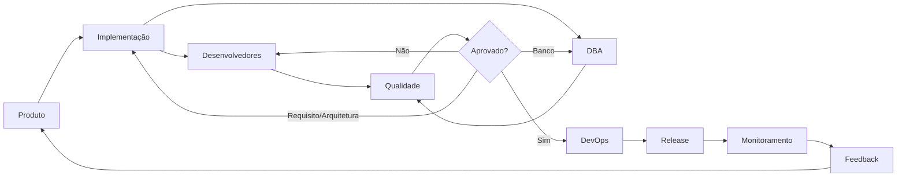

# Pipeline de Desenvolvimento — Work Chat IA

Este documento define o fluxo operacional oficial para executar mudanças no projeto usando as skills.

## 1. Fluxo oficial



## 2. Regra de passagem

Nenhuma etapa deve assumir que a etapa anterior foi concluída apenas porque existem arquivos modificados.

Cada handoff deve produzir evidência mínima.

| Etapa | Entrada | Saída obrigatória | Próximo |
|---|---|---|---|
| Produto | problema/necessidade | requisito + aceite | Implementação |
| Implementação | requisito aprovado | plano técnico + impactos | Desenvolvimento/DBA |
| Desenvolvimento | plano técnico | código + testes | Qualidade |
| DBA | impacto de dados | migration/modelo/validação | Qualidade |
| Qualidade | código + testes + dados | relatório de validação | Dev/Implementação ou DevOps |
| DevOps | entrega aprovada | artefato + deploy + observabilidade | Release/Operação |

## 3. Estados da execução

Uma mudança deve possuir um estado operacional:

```text
DRAFT
  ↓
PRODUCT_READY
  ↓
IMPLEMENTATION_READY
  ↓
IN_DEVELOPMENT
  ↓
DATA_READY
  ↓
QUALITY_VALIDATION
  ├── REWORK_DEVELOPMENT
  ├── REWORK_IMPLEMENTATION
  └── BLOCKED
  ↓
RELEASE_READY
  ↓
DEPLOYING
  ↓
DEPLOYED
  ↓
OBSERVING
  ↓
DONE
```

Não confundir estes estados operacionais com os estados de domínio de `Message` ou `MessageReview`.

## 4. Contrato de handoff

Todo handoff deve registrar:

- objetivo;
- requisito de origem;
- arquivos/documentos relevantes;
- decisão tomada;
- artefatos produzidos;
- testes/evidências disponíveis;
- riscos;
- pendências;
- critério para aceitar a próxima etapa.

### Exemplo

```yaml
handoff:
  from: implementacao
  to:
    - desenvolvedores
    - dba
  objective: "Implementar revisão de mensagem"
  requirement: "REQ-001"
  bounded_contexts:
    - message
    - review
  artifacts:
    - docs/03-arquitetura/...
    - docs/04-fluxos/...
  database_change: true
  async_processing: true
  acceptance_ready: true
  risks:
    - "duplicidade de processamento"
  next_gate: "código + migration + testes"
```

## 5. Critérios por etapa

### Produto → Implementação

Obrigatório:

- ator;
- problema;
- comportamento esperado;
- regras de negócio;
- critérios de aceite;
- exceções relevantes.

Se faltar informação que altere o desenho, a mudança retorna para Produto.

### Implementação → Desenvolvimento

Obrigatório:

- bounded context;
- caso de uso;
- classes/interfaces principais;
- dependências;
- contrato de API/evento;
- sequência quando aplicável;
- impacto no banco;
- estratégia de testes;
- necessidade de ADR.

Se a implementação exigir redefinição de regra de negócio, retornar para Produto.

### Implementação → DBA

Obrigatório quando houver persistência:

- entidades/tabelas afetadas;
- relacionamentos;
- constraints;
- índices;
- estratégia de migration;
- impacto de concorrência;
- compatibilidade com deploy.

### Desenvolvimento → Qualidade

Obrigatório:

- código implementado;
- testes executados;
- migrations incluídas quando necessárias;
- evidência de comportamento;
- limitações conhecidas.

### DBA → Qualidade

Obrigatório quando houver alteração de banco:

- migration validada;
- schema esperado;
- índices;
- queries críticas avaliadas;
- riscos de lock/performance;
- estratégia de compatibilidade.

### Qualidade → DevOps

Somente quando:

- critérios de aceite atendidos;
- testes relevantes passaram;
- defeitos críticos resolvidos;
- migrations validadas;
- riscos residuais conhecidos.

### DevOps → Operação

Obrigatório:

- artefato identificável;
- versão;
- configuração;
- migration aplicada;
- smoke test;
- logs/métricas;
- rollback conhecido.

## 6. Rework

Qualidade não deve corrigir código silenciosamente.

- defeito de implementação → Desenvolvedores;
- erro de desenho → Implementação;
- requisito ambíguo/incorreto → Produto;
- problema de schema/query/migration → DBA;
- problema de build/deploy/runtime → DevOps.

Após correção, a execução retorna à etapa apropriada do pipeline.

## 7. Regras de paralelismo

Desenvolvedores e DBA podem trabalhar em paralelo quando:

- o contrato de persistência estiver definido;
- o schema esperado estiver claro;
- não houver decisão arquitetural pendente.

Qualidade começa depois que código e mudanças de dados relevantes estiverem disponíveis.

DevOps pode preparar pipeline/container antes da conclusão da funcionalidade, mas o deploy de produção depende do gate de Qualidade.

## 8. Gate de release

Uma entrega só pode chegar a `RELEASE_READY` quando:

- Produto confirma o aceite;
- Implementação confirma aderência arquitetural;
- Desenvolvimento confirma implementação e testes;
- DBA confirma persistência, quando aplicável;
- Qualidade confirma validação;
- DevOps confirma capacidade de entrega/rollback.

## 9. Princípio de rastreabilidade

Uma alteração deve ser rastreável:

```text
Requisito
  ↓
Decisão técnica
  ↓
Código
  ↓
Migration/Event/API
  ↓
Teste
  ↓
Release
```

O objetivo é permitir responder: "por que esta linha de código existe e qual requisito ela atende?"
